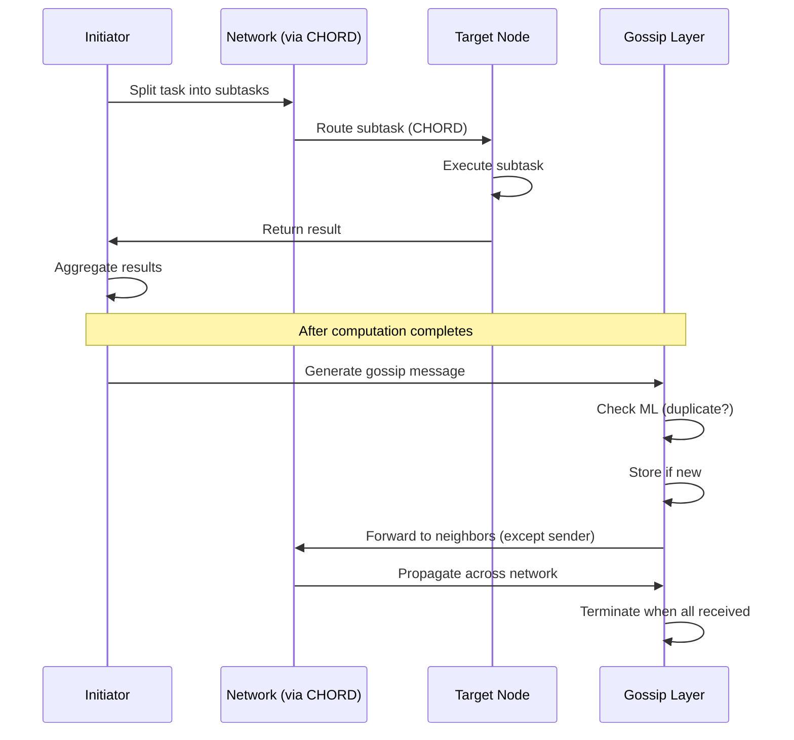

# 📡 OMNeT++ Assignment 2 – P2P Network with CHORD & Gossip

## 🧠 Overview

This project simulates a **Peer-to-Peer distributed system** in OMNeT++ with:

* Ring-based topology
* CHORD-inspired routing (logarithmic lookup)
* Distributed task execution
* Gossip-based dissemination with duplicate suppression

The goal is to demonstrate **efficient routing + decentralized coordination**.

---

## ⚙️ Core Components

* **ClientNode**

  * Handles routing, execution, and gossip
* **NetworkController**

  * Initializes topology and finger tables
* **CHORD Layer**

  * Optimizes routing from **O(N) → O(log N)**
* **Gossip Layer**

  * Ensures eventual message propagation across all nodes

---

## 🔄 End-to-End Flow (This is the key diagram)



👉 This captures the **entire system in one view**:

* Task distribution
* CHORD routing
* Execution + aggregation
* Gossip propagation

---

## ⚡ Key Logic

### CHORD Routing

* Each node maintains:

  ```
  finger[i] = (node + 2^i) % N
  ```
* Routing uses **closest preceding finger**
* Ensures **logarithmic hops**

---

### Gossip Protocol

* Message format:

  ```
  <timestamp>:<node_id>:<client_id>
  ```
* Rules:

  * Forward only to **neighbors**
  * Do not send back to sender
  * Drop duplicates using ML
  * Terminate when all messages received

---

## 📁 Project Structure

```
ClientNode.cc / .h        → Node logic
NetworkController.cc / .h → Initialization
network.ned              → Topology definition
omnetpp.ini              → Simulation config
messages.msg             → Message types
topo.txt                 → Input
outputfile.txt           → Logs
```

---

## ▶️ Run

```bash
make
./assignment_2 -m -n . omnetpp.ini
```

---

## 📊 Complexity

| Component       | Complexity |
| --------------- | ---------- |
| Routing (Ring)  | O(N)       |
| Routing (CHORD) | O(log N)   |
| Gossip          | O(N)       |

---

## 🎯 Highlights

* Efficient **CHORD-based routing**
* Correct **distributed execution pipeline**
* Robust **gossip with duplicate suppression**
* Clean modular OMNeT++ design

---
